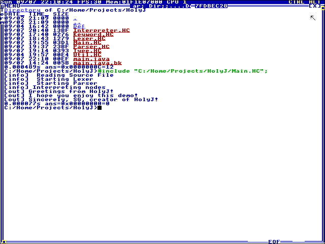

# HolyJ

The one and only Minimal Java Interpreter written fully in HolyC!

This program has been written within a single week  
I started on 01/09/2025 and took 6full days to write the code  
I've taken things a bit slower today and only did some minor bugfixes  
(Very subtle storytelling iknow lmao)

I encourage anyone to try and run the code themselves :P

## Notes
- I will try to provide an image soon, so you don't *have* to figure out how to import it into TempleOS
- There are A LOT of bugs and unfinished code branches, I am fully aware of this (they'll be fixed)
